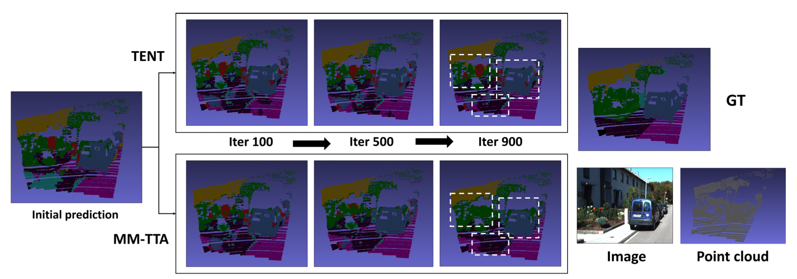
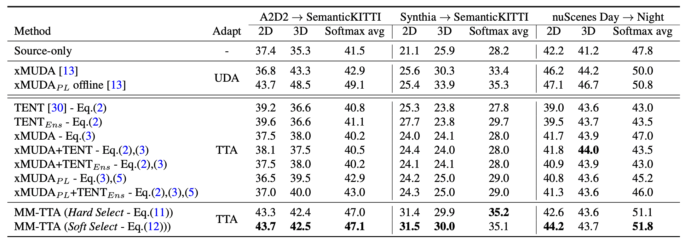

# MM-TTA: Multi-Modal Test-Time Adaptation for 3D Semantic Segmentation \[Kor\]

### Title & Description

_MM-TTA: Multi-Modal Test-Time Adaptation for 3D Semantic Segmentation \[Eng\]_

_&lt;Shin et al.&gt; / &lt;MM-TTA: Multi-Modal Test-Time Adaptation for 3D Semantic Segmentation&gt; / &lt;CVPR 2022&gt;_

[**English version**](cvpr-2022-mmtta-eng.md) of this article is available.

##  1. Problem definition

Domain adaptation는 source data에서 train된 모델이 target data에 적합하도록 모델을 적응 시키는 task입니다.

Source data가 항상 접근 가능한 것이 아니기에 Test-time adaptation이 시도되고 있습니다.

Uni-modal semantic segmentation에서 사용하는 방법들은 multi-modal에 그대로 적용할 수는 없습니다.

이 논문에서는 multi-modality task의 장점을 최대한 이용할 수 있는 방법을 제안합니다.

## 2. Motivation

### Related work

Test-time adaptation은 source data 없이 domain adaptation을 수행하는 기법입니다. Test-time training은 proxy task를 통해 model parameter를 업데이트 합니다. 그러나 training sample을 필요로 하고, 최적의 proxy task를 찾는 것은 어렵습니다. TENT는 proxy task없이 batch norm parameter를 업데이트 하는 첫 번째 방법으로, 간단하고 효과적인 방법입니다. 그러나 TENT는 entropy를 최소화하는 방식으로 이루어지기에 잘못된 prediction에 대한 confidence를 높이는 경향이 있습니다. S4T는 pseudo label을 regularize하는 방법으로 이루어지는데, spatial augmentation이 가능한 task에 한해서만 적용할 수 있다는 한계가 있습니다.

3D semantic segmentation은 3D scene에 대한 이해를 통해 각 LiDAR point를 분류하는 방법을 연구하는 중요한 task로 알려져 있습니다. 3D point들을 2D image plane에 정사영하거나 point cloud를 voxelize, 혹은 SparseConvNet을 활용하는 방법들은 2D 문맥 정보를 사용하지 않는데, 복잡한 의미론적 정보를 이해하는데에는 이 2D 문맥 정보가 매우 중요합니다.

### Idea

이런 단점들을 해결하기 위해서 multi-modal 3D segmentation에 대한 연구가 이루어지고 있습니다. Multi-modal semantic segmentation에서는 RGB와 point cloud의 두가지 정보를 잘 융합하는 기법이 중요한데, RGB는 문맥적 정보를, point cloud는 기하학적 정보를 가지고 있습니다. 2D data에는 style distribution, 3D data에는 point distribution의 dataset bias가 존재하는데, 이 때문에 multi-modality model의 domain adaptation이 더 까다롭습니다. 이 논문에서는 test-time adaptation 환경에서 multi-modal 3D semantic segmentation의 두 modality model이 jointly learn하는 방법에 대해 연구하였습니다.

## 3. Method

Intra-modal pseudo label generation
이 논문에서는 Intra-PG라는 모듈을 제안하였는데, 각각의 modality에서 신뢰할 수 있는 online pseudo label을 만드는 역할을 합니다. 다른 속도로 업데이트 되는 두개의 다른 모델을 활용하는 방법으로, Fast model은 batch normalization 통계들을 바로 업데이트 하고 Slow model은 fast model로부터 momentum update됩니다(식 6). 두 모델은 공격적으로, 점진적으로 stable하고 상보적인 supervisory signal을 줍니다. Inference time에는 Slow model만 사용됩니다. 두 모델은 logit의 평균을 통해 fusion됩니다.

Inter-modal pseudo label refinement
이 논문에서는 Inter-PR이라는 모듈을 제안하였는데, Cross-modal fusion을 통해 pseudo label을 발전시키는 방식입니다. 다른 속도로 업데이트 되는 두 모델의 consistency를 이용해 어떤 modality의 output을 pseudo label로 취할 것인지 정합니다. Modality를 고르는 방법에는 hard와 soft selection 방법이 있는데 harder selection은 두 모델 사이 consistency가 높은 modality를 그대로 취하는 것이고 soft selection은 두 모델의 output의 weighted sum을 통해 pseudo label을 구합니다. Consistency는 KL Divergence의 역수를 통해 측정합니다. 두 modality의 consistency가 일정 threshold보다 낮은 경우 해당 pseudo label은 무시합니다. Loss 함수는 아래와 같습니다.

###### *Q. inter-PR 에서 hard selection 시, 두 모델 사이 consistency 가 높은 modality 를 취한다고 하는데, 두 모델은 fast model 와 slow model 인가요? 그래서 각 modality 별로 fast 와 slow model 의 consistency 를 구하고, 더 consistent 한 modality 를 선택하는건가요? 그렇다면, 두 모델의 consistency 를 기준으로 잡은 이유가 궁금합니다. 두 모델이 consistent 하지 않다면, 불안정한 모델로 여기는 건가요?*

###### *A. 본 논문에서 fast, slow model의 consistency를 고려하는 것은 source data 접근이 불가능한 TTA setting을 보완하기 위함이라 생각합니다. UDA의 경우 Source data에 대해서도 꾸준히 학습하여 모델이 task의 전체적인 구조 보다 test set에 대한 loss만 줄이는 방향으로 빠지는 것을 막을 수 있습니다. 그러나 TTA에서는 그것이 불가능하기 때문에 Source data의 학습된 모델의 prediction 으로부터 크게 벗어나지 않는 선에서 test data에 adapt 하는 방식으로 학습한 것으로 보입니다.*

## 4. Experiment & Result

### Experimental setup

#### Dataset

A2D2 dataset은 2.3 MegaPixel 카메라와 16채널 LiDAR로, SemanticKITTI는 0.7 MegaPixel 카메라와 64채널 LiDAR로부터 수집되었습니다. nuScenes는 real-world case를 위해 이용되었는데 낮 시간동안 수집된 image들은 분명 밤 시간의 이미지와 명확히 다른 빛 조건을 가지고 있습니다. Synthia-to-semanticKITTI는 synthetic과 real data 사이의 test-time adaptation을 위해 수행되었습니다.

#### Baselines

Entropy를 통한 self-learning은 TENT에서 제안되었는데, model prediction의 entropy를 감소시키는 방식을 취합니다. 이 실험에는 Fast model만이 사용되었으며, 이 loss 함수의 경우 distribution을 더 좁게 만들게 할 뿐이기에 틀린 prediction을 더 강화할 수 있고, cross-modal consistency에 대해 고려하지 못합니다.

###### *Q. 두 modality 간의 consistency 를 계산하지 못한다고 나와 있는데, 따로 penalty 를 주지 않아도 cross-modal consistency 가 보존되는 건가요? 아니면, 본 연구는 두 modality 중 더 consistent 한 modality 를 선택하기 때문에, cross-modal consistency 는 중요하지 않은건가요?*

###### *A. 두 modality 간의 consistency를 제대로 측정하지 못하는 이유 역시 source data에 접근을 할 수 없기 때문입니다. 특히 두 modality의 prediction이 동일한 오답일 경우가 좋은 예라고 할 수 있습니다. Consistent 함에도 불구하고 그 prediction에 대해서는 penalize 하지 않는 것이지요. 따라서 본 논문에서는 두 modality의 prediction에서 consensus를 고려하기 보다는 1번 질문의 답변과 같이 더 consistent한 model의 output을 pseudo-label로 하여 두 modality가 같은 prediction을 하도록 합니다.*

###### *Q. Baseline 모델에서 entropy, consistency, pseudo label 을 이용한 self-learning 모델이 각각 TENT, xMUDA, MM-TTA 라고 이해하면 될까요? 각 category 에 해당하는 baseline 모델이 무엇인지 헷갈립니다*.

###### *A. TENT의 경우 entropy를 고려한 방법이고, xMUDA가 consistency를 고려한 방법인 것은 맞습니다만 xMUDA에서도 pseudo-label을 사용한 setting이 있습니다. Cross-modal consistency에 추가적으로 각 modality 내에서 pseudo-label로 self-training을 하는 것이지요. 본 논문에서 제안하는 방법인 MM-TTA의 핵심은 두 modality간의 interaction을 통한 pseudo-label generation이라고 할 수 있습니다.*

Consistency를 통한 Self-learning는 두 modality model간의 consistency를 키우는 방식으로 multi-modal test-time adaptation을 학습합니다. xMUDA와 같이 source data를 통해 regularize 할 수 있는 기법들과 달리 MM-TTA는 source data에 접근하지 못하는 상황을 가정합니다. 그렇기에 틀린 prediction이 발생한 경우 두 modality 사이의 consistency를 제대로 측정하지 못할 수 있습니다.

Pseudo-label을 통한 self-learning은 segmantation loss를 통해 학습합니다. Pseudo-label은 식 4와 같이 prediction들을 thresholding하여 구할 수 있습니다. Batch normalization statistic만을 학습시키는데다 두 modality의 pseudo label간 정제가 이루어지지 않기 때문에 최적의 학습 방법이 아닙니다.

#### Training Setup

이 논문에서는 two-stream multi-modal framework인 xMUDA의 세팅을 따랐는데, ResNet34로 이루어진 U-Net encoder를 이용해 2D branch를 구성하였고, 3D branch의 경우 SparseConvNet혹은 MinkowskiNet를 이용해 voxelize된 point cloud input을 sparse convolution이 활용된 U-Net에 통과 시켰습니다.

SparseConvNet의 경우 공평한 비교를 위해 xMUDA official pre-trained model을 이용했으며 MincowskiNet의 경우 source data를 이용해 처음부터 train하였습니다.

TTA는 batch norm affine parameter만을 update하며, 1 epoch adaptation 이후의 성능을 report하였습니다.

#### Evaluation metric

논문의 저자들은 mIoU를 평가 지표로 이용했습니다. mIoU는 semantic segmentation task에서 흔히 사용되는 지표입니다. mIoU를 구하기 위해서는 confusion matrix가 필요합니다. Confusion matrix는 각 category 쌍이 얼마나 많이 존재하는지를 통해 얻어집니다. 이 때 category 쌍이란 ground truth와 prediction의 조합을 말합니다. #class * # class 개의 조합이 존재합니다. Confusion matrix의 대각선 성분들은 intersection으로, 그 위에 놓인 십자가가 통과하는 모든 성분들은 union으로 간주됩니다. 모든 조합들의 IoU를 평균을 취하면 mIoU를 얻을 수 있습니다.

### Result

UDA의 경우 xMUDA framework를 통해 비교했는데, 이때 consistency loss, offline pseudo-label을 이용한 self-training을 활용했습니다. TTA baseline의 경우 TENT, xMUDA, xMUDA_pl을 평가했습니다. TENT를 두가지 modality에 확장하였는데, 2D와 3D logit의 ensemble의 entropy를 줄이는 방법으로 학습했습니다.

MM-TTA는 모든 baseline 보다 좋은 성능을 보였고, entropy와 pseudo-label를 이용한 기법이 consistency loss를 이용한 모델보다 좋은 성능을 보였습니다. 이는 A2D2-to-SemanticKITTI와 Synthia-to-SemanticKITTI의 경우 modality간 consistency를 잡아내는것이 어렵기 때문입니다. 몇몇 TTA baseline들이 2D와 3D performance 각각은 성능 향상을 보였지만, ensemble result는 source-only model보다 좋지 못한 성능을 보였습니다. 이것은 두 multi modal output이 jointly learn하도록 디자인되지 않았기 때문입니다.

nuScenes의 Day-to-Night Domain gap은 LiDAR보다는 RGB에서 더 큰데, 그렇기 때문에 2D branch의 성능이 얼마나 향상되는지가 중요합니다. Inter-PR이 이 부분에서 기여하고 있고, 그 성능을 보여주고 있습니다.

$xMUDA$ : Consistency between the two modalities

$xMUDA_{PL}$ : Consistency between the two modalities + intra pseudo-label

$TENT$ : Self-training with entropy.

$TENT_{ENS}$ : Self-training with entropy. Entropy minimization on the ensemble of the logits from the two modalities.

$MM-TTA$ : The self-training with the pseudo-label generated with the interaction between the two modalities
## 5. Conclusion

이 논문에서는 multi-modal 3D semantic segmentation에서의 test-time adaptation이라는 문제를 정의하였습니다. 한계가 있는 기법들을 그대로 가져오기보다 pseudo label을 modality 내에서 혹은 modality간에 정제해주는 참신한 방법을 제안했습니다. 이 논문의 method는 3D semantic segmentation이라는 task의 특징을 깊게 분석하지는 않았기에 더 발전될 여지가 있습니다. 뿐만 아니라 multi-modal supervisory signal을 이용한 모든 task에 활용할 수 있는 방식입니다.

###### *Q. 실제 시나리오에 필요한 unseen data에 대한 practical한 방법으로 test time adaptation관련 연구가 진행되고 있고, 특히 multi modal 상황에서 다양한 센서 입력을 활용하는 방법으로 보입니다. 다양한 입력 센서 데이터의 fusion시, 입력 주기가 다르고 sync가 맞지 않는 부분들은 구체적으로 어떻게 처리되었는지 궁금합니다.*

###### *A. 본 논문은 두 modality에서의 representation을 fuse하지 않고 각각이 prediction을 하고 높은 confident를 갖는 modality의 prediction을 취하는 방식이며 real time에서 실제 sync를 맞추는 것보다는 두 modality간의 interaction에 더 무게를 둔 연구입니다. 다양한 센서의 입력의 sync를 맞추는 방법에 대한 연구는 향후 연구 방향으로 아주 좋은 주제인 것 같습니다.*

### Take home message \(오늘의 교훈\)

 > Test-time adaptation은 real-world 시나리오에서 적합하기에 최근 많은 연구가 이루어지고 있습니다.
 > 이 연구를 시작으로 community에서는 task 혹은 modality에 적합한 feature를 잘 정제해내는 방향으로 성능 향상을 기대할 수 있을 것입니다.
 > 이 framework는 다른 분야에서도 활용될 수 있을 것 입니다.
 > Test-time adaptation의 초기 work으로서, 모든 machine learning community에 훌륭한 인사이트를 제공할 것 입니다.
 
## Author / Reviewer information

### Author

** 류형곤 \(Hyeonggon Ryu\)** 

* Affiliation \(KAIST\)
* Contact information \(gonhy.ryu@kaist.ac.kr)

### Reviewer

1. Korean name \(English name\): Affiliation / Contact information
2. Korean name \(English name\): Affiliation / Contact information
3. ...

## Reference & Additional materials

1. Inkyu Shin, Yi-Hsuan Tsai, Bingbing Zhuang, Samuel Schulter, Buyu Liu, Sparsh Garg, In So Kweon, Kuk-Jin Yoon. MM-TTA: Multi-Modal Test-Time Adaptation for 3D Semantic Segmentation. In CVPR, 2022.
2. Dequan Wang, Evan Shelhamer, Shaoteng Liu, Bruno Ol- shausen, and Trevor Darrell. Tent: Fully test-time adaptation by entropy minimization. In ICLR, 2021.
3. MaximilianJaritz,Tuan-HungVu,RaouldeCharette,E ́milie Wirbel, and Patrick Pe ́rez. xmuda: Cross-modal unsupervised domain adaptation for 3d semantic segmentation. In CVPR, 2020.
4. Christopher Choy, JunYoung Gwak, and Silvio Savarese. 4d spatio-temporal convnets: Minkowski convolutional neural networks. In CVPR, 2019.
5. Benjamin Graham, Martin Engelcke, and Laurens Van Der Maaten. 3d semantic segmentation with submanifold sparse convolutional networks. In CVPR, 2018.
